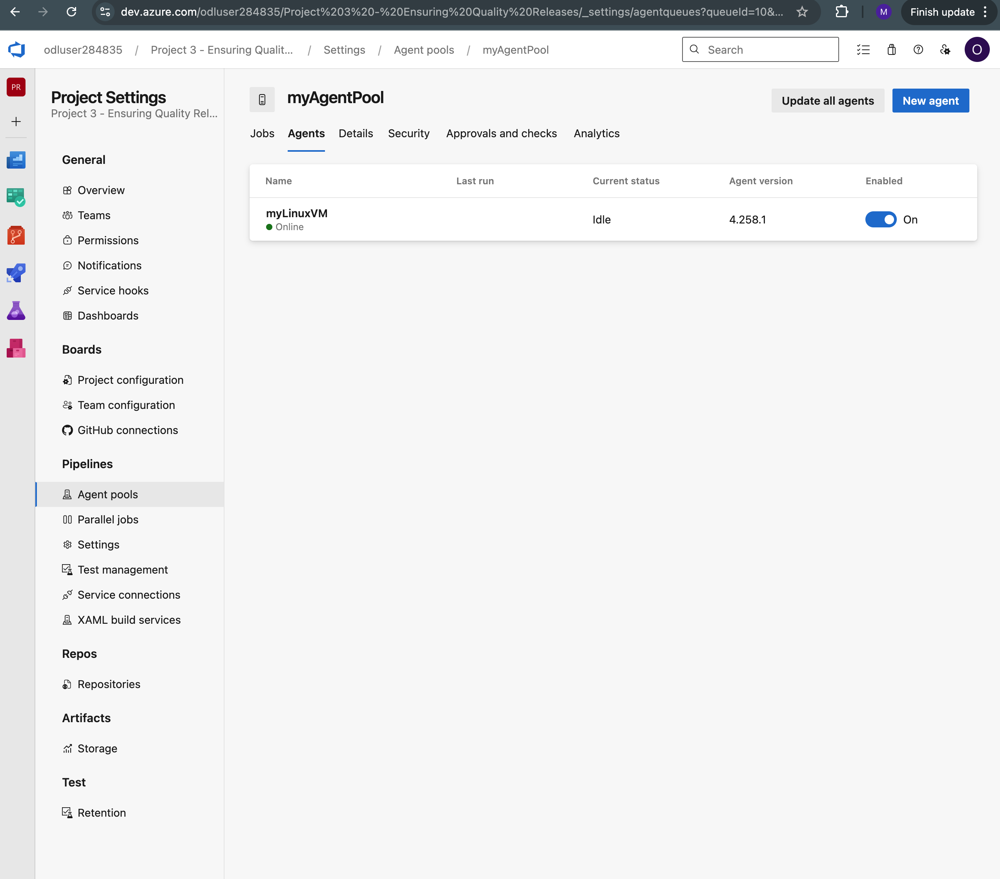

# Udacity Cloud DevOps using Microsoft Azure
## Project 3: Ensuring Quality Releases

### Description
This repo walks demonstrates the deployment and testing of a rest api using Terraform, Packer, Jmeter, Postman and Azure

## Dependencies
- Azure account
- Azure CLI
- [Azure DevOps Portal](https://app.vssps.visualstudio.com/_signin)
- [Azure dashboard](https://portal.azure.com)
- Terraform CLI
- JMeter
- Postman


## Getting Started
### Azure
```zsh
az login
```
*Note the ``Azuredevops`` resource group location in the Azure developer portal*

### Env variables
Fill in ``load_env.sh`` and rerun this command whenever you modify variables in it
```zsh
source load_env.sh
```
*Note that ``terraform.tfvars`` isnt required for local development if you use ```load_env.sh```, but it neeeds to be uploaded to the pipelines library for production use*

### Create Storage Account
```zsh
## For Mac/Linux
## Assuming you are in the terraform/environments/test directory in the starter code
chmod +x configure-tfstate-storage-account.sh
./configure-tfstate-storage-account.sh
```
Then copy the output values over to ```main.tf``` and to ```load_env.sh```
Example:
```zsh
    terraform {
        backend "azurerm" {
              storage_account_name = "tstate9592"
              container_name       = "tfstate"
              key                  = "test.terraform.tfstate"
        }
	}
```
*Note: You cannot use ```terraform.tfvars``` for these values.*

### Create Packer Image
Edit vars in ```packer.json```
 ```packer build ./packer.json```


### SSH Keys
```zsh
ssh-keygen -t rsa -f ~/.ssh/udacity_rsa 
cat ~/.ssh/udacity_rsa.pub
```
Then update ```load_env.sh``` and ```terraform.tfvars``` with the public key

## Local Development 
### Python virtual environment
```zsh
python -m venv myvenv
source myvenv/bin/activate
```
### Install dependencies
```bash
pip install selenium
sudo apt-get install -y chromium-browser
```
or if on Mac
```zsh
pip install selenium
brew install chromium --no-quarantine
```

### Test Terraform
Ensure all variables are set in ```terraform.tfvars``` or ```load_env.sh``` then:
```zsh
## Assuming you are in the terraform/environments/test/ directory
terraform init # add -reconfigure if you need to restart
terraform import azurerm_resource_group.main "/subscriptions/${SUBSCRIPTION_ID}/resourceGroups/${RESOURCE_GROUP_NAME}"
## Run "terraform init -upgrade" if you have changed the file contents/path
terraform plan -out "solution.plan"
terraform apply "solution.plan"
terraform state rm azurerm_resource_group.main
terraform destroy
```


## Production

### Azure DevOps Setup
- Go to [dev.azure.com](https://go.microsoft.com/fwlink/?LinkId=307137) and create a new project called `udacity_project`
- Go to **Project Settings** then **Service Connections** and **Azure Resource Manager**
- Click **App registration (automatic)** and fill in the required fields. Make sure you grant it access to all pipelines.
- In **User Settings** create a Personal Access Token and give it full access, then fill in and reload ```load_env.sh```
- Create new agent pool in **Project Settings > Agent pools** with type **self-hosted** and check **grant access permissions to all pipelines**
- Follow the steps in ```create_agent.md```. You will now see your agent online in the Dev Portal 
- Go to **Pipelines > Environments > Create environment** and create a new pipeline environment of type **Virtual Machines** then select **Generic provider** and **Linux** and copy the command it provides, then follow the steps in ```create_test_vm.md```. You will now see your vm in your environment
[myLinuxVm](./screenshots/18_test_vm_resource.png)
- Install Terraform extension from the marketplace
[Extension](./screenshots/13_install_terraform_extension.png)
- Upload ```terraform.tfvars``` to pipelines file library
- Click **Create Pipeline** and then **Existing Azure Pipelines YAML file**
- Add ```ARM_ACCESS_KEY``` variables into the pipeline, NOT library
- Click **Run**


### Alerts and Monitoring
#### Azure Monitor
Monitor to alert if a 404 error happens
- In the Azure portal go to the web app service that was just deployed
- Go to **Monitoring > Alerts** and then click **Create alert rule**
- Set the **Condition** as ```Http 4xx```
- Set the **Action Group** as Email and fill in details 
- Click **Create alert rule**

[Alert](./screenshots/44_az_email_alert.png)

#### Querying Logs
How to find specific logs within Azure
- In the Azure portal go to the web app service that was just deployed
- Go to **Log Analytics workspaces** then click **Create** and fill in the information
- After the resource is created, on the left click **Logs**
- Create a new **Connection rule** and ensure your VM's are selected
- Ensure the minimum log level is **INFO**
- Fill in the Query
```KQL
// General heartbeats, myLinuxVm should show up
Heartbeat
| where TimeGenerated > ago(2h)

// General Syslogs
Syslog
| where TimeGenerated > ago(10m)

// Selenium logs
Syslog
| where TimeGenerated > ago(30m)
| where ProcessName == "selenium" or SyslogMessage contains "Selenium"
| project TimeGenerated, Computer, Facility, SeverityLevel, ProcessName, SyslogMessage
| order by TimeGenerated desc

```
[Heartbeat](./screenshots/51_az_logs_heartbeat.png)
[General Logs](./screenshots/54_az_logs_selenium.png)


### Destroying Resources
In your local cli at ```./terraform/environments/test```
```zsh
export ARM_ACCESS_KEY=$(az storage account keys list \
  --resource-group Azuredevops \
  --account-name <tfstate12345> \
  --query '[0].value' --output tsv)

terraform init -reconfigure \
  -backend-config="resource_group_name=Azuredevops" \
  -backend-config="storage_account_name=<tfstate12345>" \
  -backend-config="container_name=tfstate" \
  -backend-config="key=test.terraform.tfstate"

terraform destroy -var-file="terraform.tfvars" -auto-approve
```

